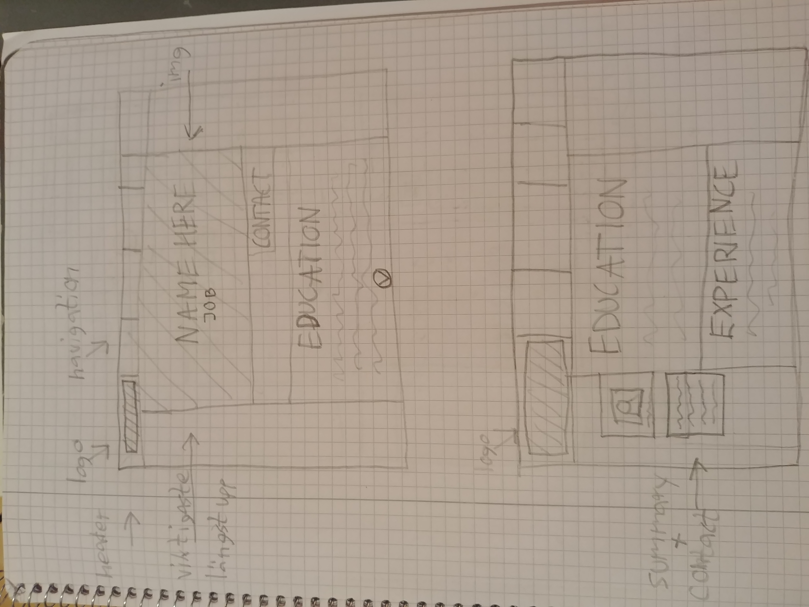
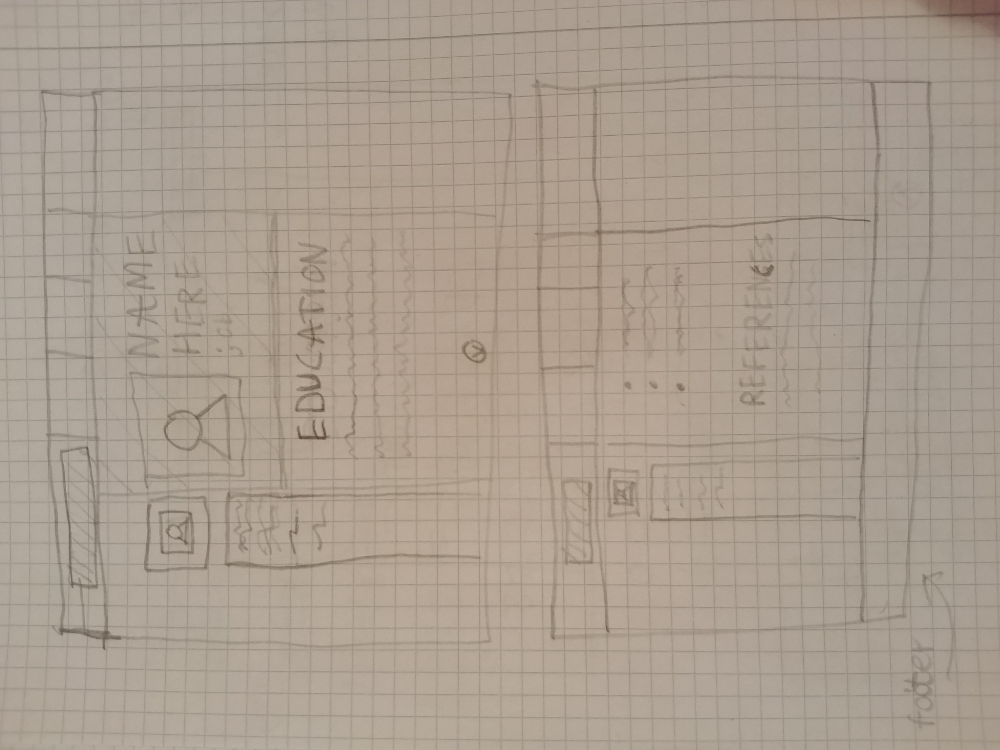

# cv-webbutveckling

# figma skiss:
https://www.figma.com/file/mqSlxMYHrEmEyME42d0C9z/cvskiss?node-id=0%3A1

# Planering:
## Komponenter och struktur: 
Samma komponenter och struktur som på min figma skiss. Kanske inte lägger till informationen på vänstra sidan.
## Färg: 
De färger jag har i skissen och kanske en bakgrundsfärg eller annat.
## Typsnitt: 
Roboto eller Montserrat.
## Visuella element: 
Bakgrundsbild bakom namnet och linjer för att fördela upp texten.
